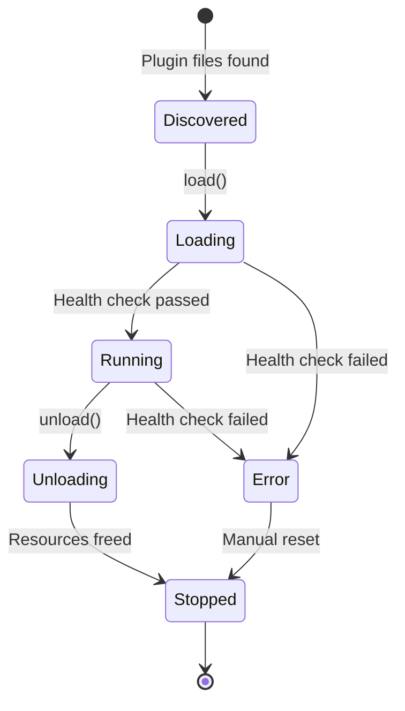

# RFC 001: PIP (Plugin Interface Protocol)

**Status:** Draft  
**Author:** liangjianzeng  
**Date:** 2026-06-24  
**Version:** 0.1.0  

---

## 1. Overview

Life2Tea is a local LLM plugin architecture system. The core design philosophy is **"plugin-first"** — all model inference, tool calling, and expert capabilities are implemented as plugins.

PIP (Plugin Interface Protocol) is the unified interface standard for all plugins in Life2Tea. It defines:
- How plugins declare their capabilities (manifest)
- How plugins are loaded/unloaded (lifecycle)
- How plugins expose their functionality (API)
- How plugins are discovered and registered (registry)

Any third-party developer can implement a plugin by following this protocol, and it will be automatically discovered and loaded by Life2Tea.

---

## 2. Plugin Manifest Format

Every plugin **MUST** have a `plugin-manifest.json` file in its root directory. This is the plugin's identity card.

### 2.1 Minimal Manifest

```json
{
  "name": "llama-cpp",
  "version": "1.0.0",
  "description": "llama.cpp backend plugin for local LLM inference",
  "type": "model",
  "entry": "plugin.py",
  "capabilities": ["chat", "completion"],
  "dependencies": {
    "python": ">=3.10",
    "system": ["llama-server.exe"]
  }
}
```

### 2.2 Full Manifest Schema

See: `schema/plugin-manifest.json`

**Required fields:**
| Field | Type | Description |
|-------|------|-------------|
| `name` | string | Plugin identifier (unique) |
| `version` | string | SemVer 2.0.0 |
| `description` | string | Human-readable description |
| `type` | string | Plugin type: `"model"` or `"expert"` |
| `entry` | string | Entry point file (relative to plugin dir) |
| `capabilities` | string[] | Capabilities exposed by this plugin |
| `dependencies` | object | Runtime dependencies |

**Optional fields:**
| Field | Type | Description |
|-------|------|-------------|
| `author` | string | Plugin author |
| `license` | string | SPDX license identifier |
| `homepage` | string | Plugin homepage URL |
| `repository` | string | Plugin source code URL |
| `keywords` | string[] | Search keywords |
| `resources` | object | Resource requirements (GPU, memory) |
| `config_schema` | object | JSON Schema for plugin config |

---

## 3. Plugin Types

Life2Tea supports two plugin types:

### 3.1 Model Plugin (`"type": "model"`)

Model plugins wrap LLM inference backends (llama.cpp, ollama, vLLM, etc.).

**Responsibilities:**
- Load/unload model into GPU memory
- Expose OpenAI-compatible API (`/v1/chat/completions`)
- Report health status
- Report resource usage (GPU memory, inference speed)

**Interface (Python abstract class):**

```python
from abc import ABC, abstractmethod
from typing import AsyncGenerator, Dict, Any, Optional

class IModelPlugin(ABC):
    """Interface for model plugins."""
    
    @abstractmethod
    def load(self, config: Dict[str, Any]) -> None:
        """Load model with given config.
        
        Args:
            config: Plugin configuration (from config.json)
        """
        ...
    
    @abstractmethod
    def unload(self) -> None:
        """Unload model and free resources."""
        ...
    
    @abstractmethod
    def health(self) -> Dict[str, Any]:
        """Return health status.
        
        Returns:
            {"ok": True, "status": "running", "gpu_memory_mb": 8192}
        """
        ...
    
    @abstractmethod
    async def infer(
        self,
        messages: list[Dict],
        stream: bool = True,
        **kwargs
    ) -> AsyncGenerator[Dict, None] | Dict:
        """Run inference.
        
        Args:
            messages: OpenAI-format messages
            stream: Whether to stream response
            **kwargs: Model-specific params (temperature, top_p, etc.)
        
        Returns:
            If stream=True: AsyncGenerator yielding SSE chunks
            If stream=False: Complete response dict
        """
        ...
    
    @property
    @abstractmethod
    def is_loaded(self) -> bool:
        """Check if model is loaded."""
        ...
    
    @property
    @abstractmethod
    def resource_usage(self) -> Dict[str, Any]:
        """Return current resource usage.
        
        Returns:
            {"gpu_memory_mb": 8192, "cpu_percent": 45.2, ...}
        """
        ...
```

### 3.2 Expert Plugin (`"type": "expert"`)

Expert plugins provide tool-calling capabilities (calculator, web search, code execution, etc.).

**Responsibilities:**
- Declare available tools (function definitions)
- Execute tool calls
- Return structured results

**Interface (Python abstract class):**

```python
from abc import ABC, abstractmethod
from typing import Dict, Any, List

class IExpertPlugin(ABC):
    """Interface for expert plugins."""
    
    @abstractmethod
    def get_tools(self) -> List[Dict]:
        """Return tool definitions (OpenAI format).
        
        Returns:
            [
                {
                    "type": "function",
                    "function": {
                        "name": "calculator",
                        "description": "Evaluate a math expression",
                        "parameters": {...}
                    }
                }
            ]
        """
        ...
    
    @abstractmethod
    def execute(self, tool_name: str, arguments: Dict[str, Any]) -> Dict[str, Any]:
        """Execute a tool call.
        
        Args:
            tool_name: Name of the tool to execute
            arguments: Tool arguments (JSON-decoded)
        
        Returns:
            {"ok": True, "result": 42} or {"ok": False, "error": "..."}
        """
        ...
    
    @abstractmethod
    def health(self) -> Dict[str, Any]:
        """Return health status."""
        ...
```

---

## 4. Plugin Lifecycle



### 4.1 Lifecycle Stages

| Stage | Description |
|-------|-------------|
| **Discovered** | Plugin manifest found during directory scan |
| **Loading** | `load()` called, model/tool initializing |
| **Running** | Plugin healthy, ready to serve requests |
| **Unloading** | `unload()` called, resources being freed |
| **Stopped** | Plugin stopped, can be restarted |
| **Error** | Plugin in error state (crash, health check failed) |

### 4.2 Lifecycle Management

The `PluginLifecycleManager` (in `backend/app/plugins/lifecycle.py`) manages plugin lifecycles:

```python
class PluginLifecycleManager:
    def start_plugin(self, plugin_name: str, config: Dict) -> bool:
        """Start a plugin (Discovered → Loading → Running)."""
        ...
    
    def stop_plugin(self, plugin_name: str) -> bool:
        """Stop a plugin (Running → Unloading → Stopped)."""
        ...
    
    def restart_plugin(self, plugin_name: str) -> bool:
        """Restart a plugin."""
        ...
    
    def check_health(self, plugin_name: str) -> Dict:
        """Check plugin health and update status."""
        ...
```

---

## 5. Plugin Registry

The `PluginRegistry` (in `backend/app/plugins/model_registry.py` for models, `expert_registry.py` for experts) is responsible for:

1. **Discovery**: Scan plugin directories for `plugin-manifest.json`
2. **Registration**: Load and validate plugin manifests
3. **Resolution**: Find plugin by name/capability
4. **Configuration**: Manage plugin-specific configs

### 5.1 Directory Structure

```
plugins/
├── models/
│   ├── llama-cpp/
│   │   ├── plugin-manifest.json
│   │   ├── plugin.py
│   │   └── ...
│   └── ollama/
│       ├── plugin-manifest.json
│       └── ...
└── experts/
    ├── calculator/
    │   ├── plugin-manifest.json
    │   └── ...
    └── web-search/
        ├── plugin-manifest.json
        └── ...
```

### 5.2 Plugin Discovery

```python
def discover_plugins(plugins_dir: str) -> List[Dict]:
    """Scan plugins directory and return discovered plugins."""
    plugins = []
    for manifest_path in Path(plugins_dir).rglob("plugin-manifest.json"):
        with open(manifest_path) as f:
            manifest = json.load(f)
        plugins.append(manifest)
    return plugins
```

---

## 6. Configuration

Each plugin has its own configuration file: `config/plugin.{plugin_name}.json`

### 6.1 Model Plugin Config

```json
{
  "plugin_name": "llama-cpp",
  "backend_exe": "D:/MyLLM/llama.cpp/llama-server.exe",
  "model_path": "D:/MyLLM/models/LFM2-24B-A2B-Q4_K_M.gguf",
  "host": "127.0.0.1",
  "port": 8085,
  "gpu_layers": 99,
  "ctx_size": 32768,
  "threads": 8,
  "flash_attn": true,
  "cont_batching": true,
  "mlock": true
}
```

### 6.2 Expert Plugin Config

```json
{
  "plugin_name": "calculator",
  "max_digits": 10,
  "allow_complex": false
}
```

---

## 7. API Endpoints

### 7.1 Plugin Management

| Endpoint | Method | Description |
|----------|--------|-------------|
| `/api/plugins` | GET | List all discovered plugins |
| `/api/plugins/{name}` | GET | Get plugin details |
| `/api/plugins/{name}/load` | POST | Load (start) a plugin |
| `/api/plugins/{name}/unload` | POST | Unload (stop) a plugin |
| `/api/plugins/{name}/health` | GET | Check plugin health |
| `/api/plugins/{name}/config` | GET/POST | Get/update plugin config |

### 7.2 Model Inference

| Endpoint | Method | Description |
|----------|--------|-------------|
| `/api/chat/completions` | POST | OpenAI-compatible chat completions |
| `/api/chat/completions/stream` | POST | Streaming completions (SSE) |

---

## 8. Security Considerations

1. **Plugin Isolation**: Plugins should run in isolated processes (not in the main process). Use `subprocess.Popen` to spawn plugin processes.
2. **Input Validation**: All plugin inputs must be validated (manifest schema, config schema).
3. **Resource Limits**: Enforce resource limits (GPU memory, CPU, disk) to prevent plugin from consuming all system resources.
4. **Code Signing**: (Future) Plugins should be signed to prevent malicious plugins from being loaded.

---

## 9. Migration Guide

### From LiangLLM to Life2Tea

LiangLLM's `model_manager.py` → `PluginRegistry`  
LiangLLM's `process_manager.py` → `PluginLifecycleManager`  
LiangLLM's `chat_engine.py` → `ChatHandler` (now a built-in expert plugin)

See: `docs/migration-from-liangllm.md`

---

## 10. Open Questions

1. **Plugin hot-reload**: Should plugins support hot-reload (reload without restarting the backend)?
2. **Plugin dependencies**: Should plugins declare dependencies on other plugins?
3. **Plugin marketplace**: How should plugins be distributed? (Git-based registry? Centralized registry?)

---

## 11. References

- [VS Code Extension API](https://code.visualstudio.com/api/references/vscode-api)
- [OpenAI Plugins](https://platform.openai.com/docs/plugins/introduction)
- [FastAPI Dependency Injection](https://fastapi.tiangolo.com/tutorial/dependencies/)

---

**Next RFC:** [RFC 002: MoE Dual Mapping Design](./002-moe-dual-mapping.md)
